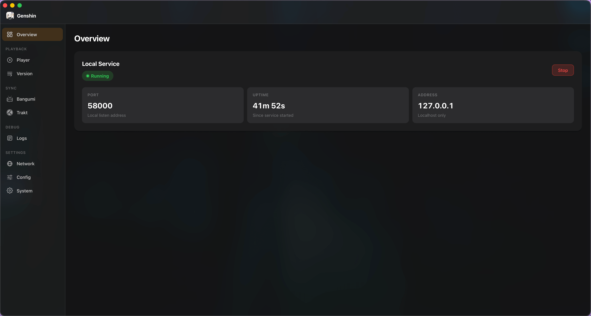
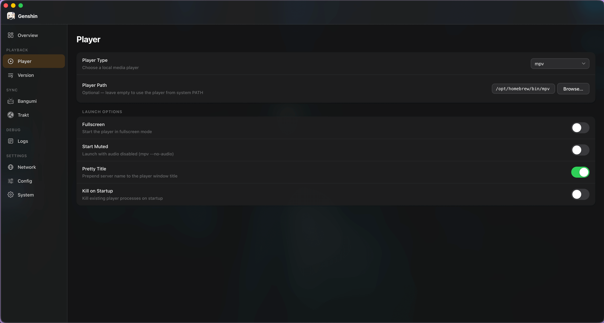
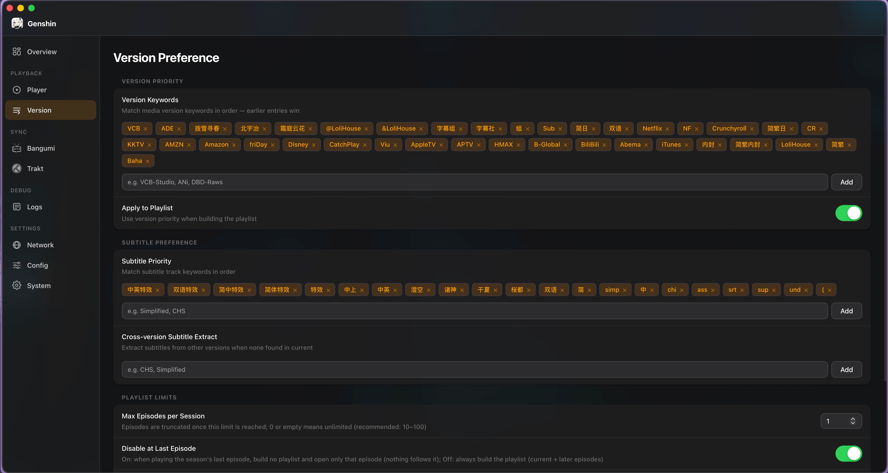
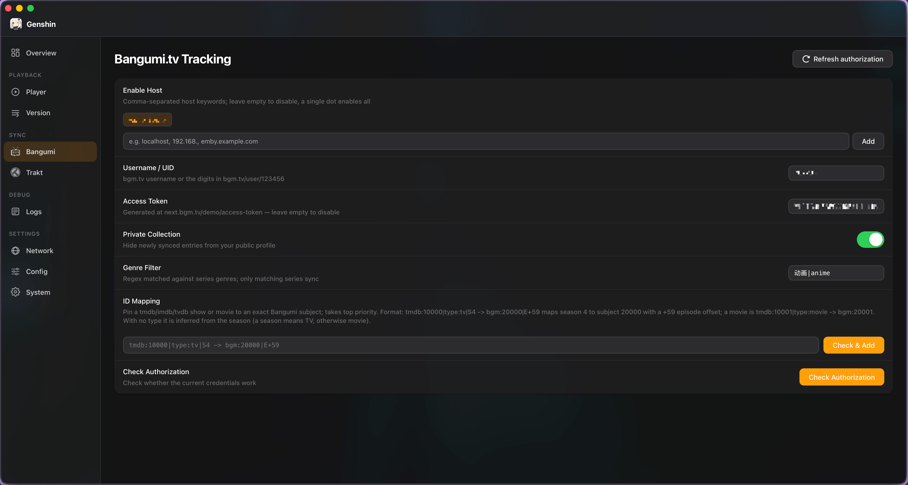
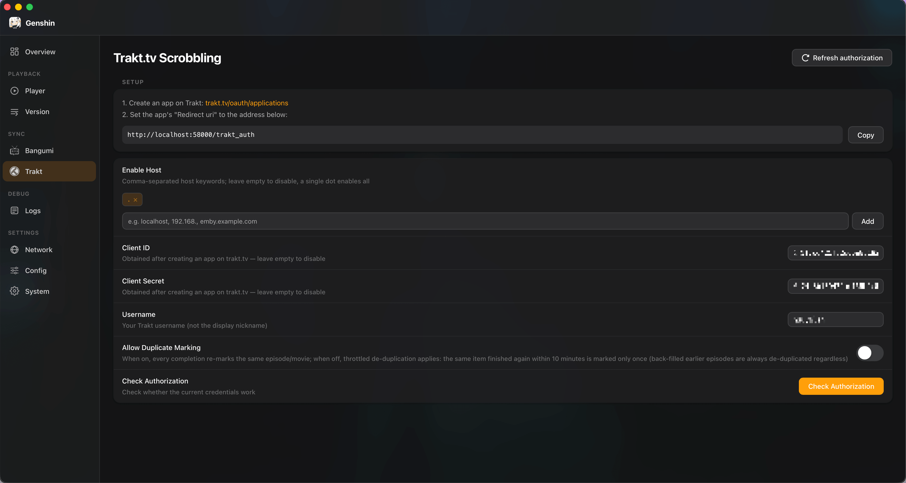
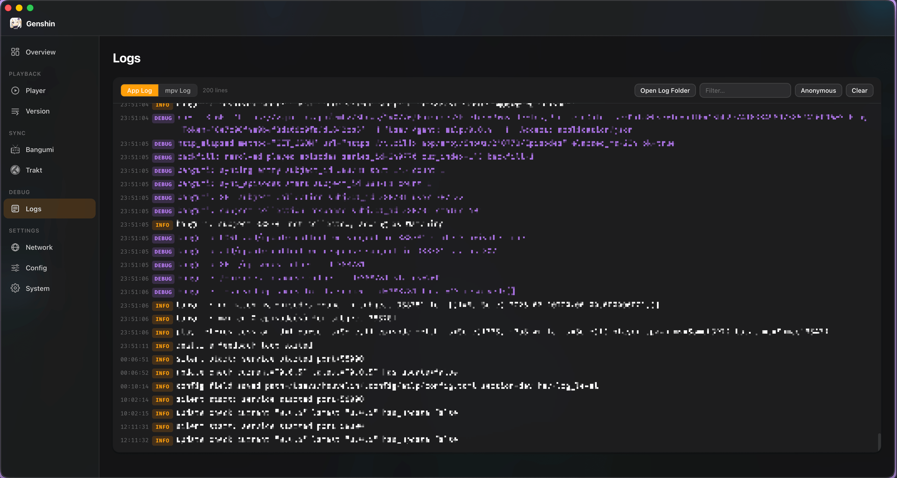
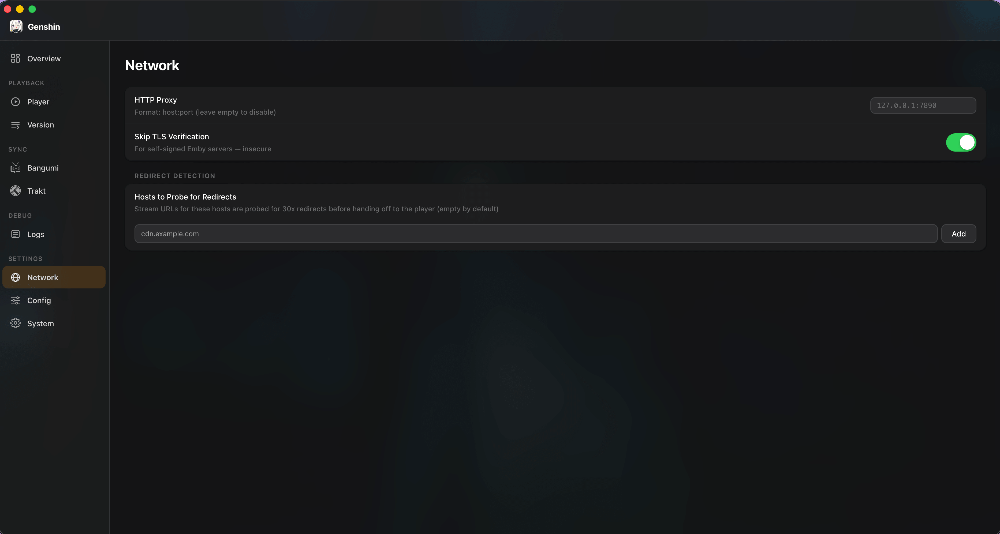
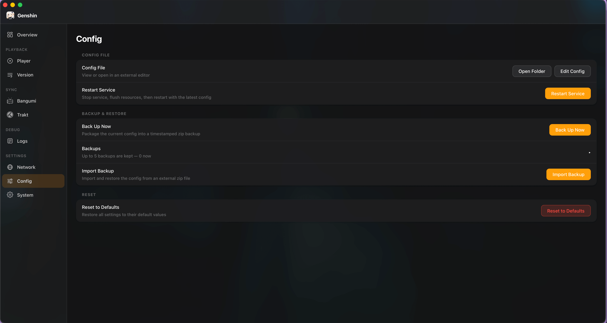
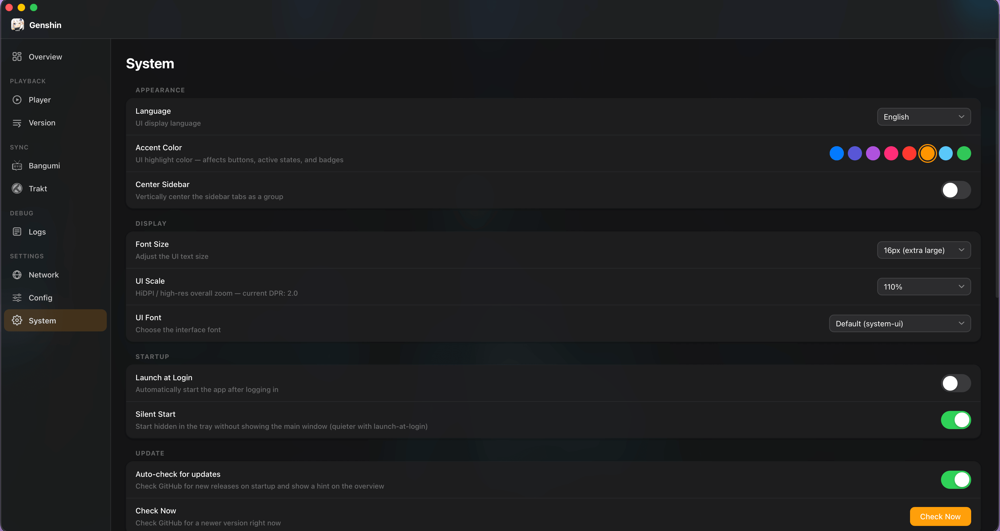

# etlp

[](https://github.com/PiliPili-Team/etlp/actions/workflows/ci-rust.yml)
[](https://github.com/PiliPili-Team/etlp/actions/workflows/ci-app.yml)
[](LICENSE)
[](https://github.com/PiliPili-Team/etlp/releases)
[](https://github.com/PiliPili-Team/etlp/releases)
[](https://github.com/PiliPili-Team/etlp/releases)

**etlp** is a Genshin-powered media-player bridge, primarily for Emby.
It runs a lightweight local HTTP service that receives playback requests from a
browser userscript and dispatches them to a local media player — handling
playlist construction, progress write-back, and optional watch-history sync.

**Key features**

- Supports **mpv · iina · vlc · mpc-hc · potplayer · dandanplay**
- Playlist management with version/subtitle preference filtering
- Progress write-back to Emby (Jellyfin / Plex: **experimental, untested**)
- Trakt.tv and Bangumi.tv watch-history sync
- Concurrent download manager with pause / resume and rate limiting
- Native GUI for macOS and Windows (Tauri, vibrancy on macOS)
- Single static binary — zero runtime dependencies on every platform

---

## App preview

Native desktop UI with macOS vibrancy, an accent-color theme, and full
English / 简体中文 / 繁體中文 localization. Thumbnails below — click to
enlarge.

<table>
  <tr>
    <td align="center" width="33%"><a href="assets/images/01.png"></a><br/><sub><b>Overview</b> · local service status</sub></td>
    <td align="center" width="33%"><a href="assets/images/02.png"></a><br/><sub><b>Player</b> · type, path & launch options</sub></td>
    <td align="center" width="33%"><a href="assets/images/03.png"></a><br/><sub><b>Version</b> · priority & subtitle filtering</sub></td>
  </tr>
  <tr>
    <td align="center" width="33%"><a href="assets/images/04.png"></a><br/><sub><b>Bangumi</b> · watch-history sync</sub></td>
    <td align="center" width="33%"><a href="assets/images/05.png"></a><br/><sub><b>Trakt</b> · scrobbling setup</sub></td>
    <td align="center" width="33%"><a href="assets/images/06.png"></a><br/><sub><b>Logs</b> · live, masked output</sub></td>
  </tr>
  <tr>
    <td align="center" width="33%"><a href="assets/images/07.png"></a><br/><sub><b>Network</b> · proxy & redirect probing</sub></td>
    <td align="center" width="33%"><a href="assets/images/08.png"></a><br/><sub><b>Config</b> · backup, restore & reset</sub></td>
    <td align="center" width="33%"><a href="assets/images/09.png"></a><br/><sub><b>System</b> · appearance & startup</sub></td>
  </tr>
</table>

---

## Requirements

| Component    | Minimum                                                           |
| ------------ | ----------------------------------------------------------------- |
| Media player | one of: **mpv** · iina · vlc · mpc-hc · potplayer · dandanplay   |
| OS           | Linux · macOS · Windows                                           |
| Rust (build) | **1.89** (see `rust-toolchain.toml`)                              |

Release binaries are fully statically linked on Linux (musl) and have no
extra system dependencies on macOS and Windows.

---

## Installation

### Desktop app (GUI)

Download the installer for your platform from the
[Releases](https://github.com/PiliPili-Team/etlp/releases) page:

- **macOS** — `.dmg`, drag the app into `Applications`
- **Windows** — `.msi` / `.exe`, run the installer
- **Windows Portable** — `.zip`, extract anywhere, run `Genshin.exe`

The desktop app embeds the server and exposes every setting shown in the
[preview](#app-preview) above.

#### Windows Portable — write permissions

The portable build stores its `config/` and `data/` directories **next to the
executable**. On first launch the app automatically detects if it cannot write
there and shows a UAC prompt to re-launch with administrator privileges. If you
dismiss UAC the app falls back to your user-profile directories (`%APPDATA%\etlp`
and `%LOCALAPPDATA%\etlp`) instead of crashing.

Common locations that require administrator rights:

| Location | Why |
| -------- | --- |
| `C:\` (drive root) | Protected even for Administrators without elevation |
| `C:\Program Files\` | System-protected, always requires UAC |
| Any NTFS path with custom deny ACLs | Depends on folder permissions |

If you prefer not to run as administrator, place the portable folder in a
user-writable location such as `C:\Users\<you>\Apps\etlp\` or any directory
on a non-system drive, where normal user accounts have full write access.

#### First-launch security prompts (unsigned builds)

These builds are **not** code-signed with a paid Apple/Microsoft developer
certificate, so the OS shows a generic warning on first launch. The app is
**not** actually damaged and contains **no** malware — the prompts are purely a
consequence of the missing certificate.

- **macOS — "Genshin" is damaged and can't be opened:**
  the quarantine attribute the browser attaches to downloaded apps trips
  Gatekeeper. Remove it once, then reopen the app:

  ```bash
  sudo xattr -dr com.apple.quarantine /Applications/Genshin.app
  ```

- **Windows — Defender / firewall / antivirus flags the app:**
  allow it through and add it to your antivirus allow-list (whitelist). For the
  Windows Firewall prompt, tick **Allow access**; for SmartScreen, choose
  **More info → Run anyway**.

### Pre-built binary (CLI)

Prefer a headless server? Download the archive for your platform from the
[Releases](https://github.com/PiliPili-Team/etlp/releases) page, extract it,
and place the `etlp` binary somewhere on your `PATH`.

### Build from source

```bash
git clone https://github.com/PiliPili-Team/etlp
cd etlp
cargo build --release
# binary: target/release/etlp
```

---

## Quick start

```bash
# Start the HTTP server (default: http://127.0.0.1:58000)
./etlp

# One-time Trakt device-flow authentication
./etlp trakt-auth

# Mark a Bangumi episode as watched
./etlp bgm-mark-played <subject_id> <episode_sort>
```

Install the browser userscript from the
[embyToLocalPlayer repository](https://github.com/kjtsune/embyToLocalPlayer)
— it is fully compatible with this server.

Configuration is read from `config.toml` in the working directory.
See the [Wiki](https://github.com/PiliPili-Team/etlp/wiki) for the full
configuration reference and advanced settings.

---

## Platform support

| Platform | Architecture          | Notes                                          |
| -------- | --------------------- | ---------------------------------------------- |
| Linux    | x86-64 · aarch64      | Static musl binary, no system deps             |
| macOS    | x86-64 · aarch64 (AS) | mpv / iina must be in PATH                     |
| Windows  | x86-64                | mpc-hc / potplayer / dandanplay supported      |

---

## Development

```bash
# Format
cargo fmt --all

# Lint (warnings are errors)
cargo clippy --workspace --all-targets --frozen -- -D warnings

# Test (323 tests across 22 suites)
cargo test --workspace --frozen
```

---

## Workspace layout

| Crate              | Responsibility                                               |
| ------------------ | ------------------------------------------------------------ |
| `etlp-core`        | Domain types (`PlaybackData`, `Server`, `PlayerKind`) and trait contracts |
| `etlp-config`      | TOML config loading, hot-reload, string-match rules          |
| `etlp-logging`     | `tracing` setup, secret masking, 10 MB rotating file output  |
| `etlp-metrics`     | Lightweight timing (`Span`) and per-session play-chain telemetry (`PlayMetrics`) |
| `etlp-net`         | `reqwest`/`rustls` HTTP client, redirect cache, progress write-back |
| `etlp-media-server`| Emby/Jellyfin/Plex API clients, payload parsing, version selection |
| `etlp-player`      | mpv JSON IPC, VLC/MPC/PotPlayer/DandanPlay launchers, playlist management |
| `etlp-download`    | Concurrent download manager with file locking and resume     |
| `etlp-sync`        | Trakt OAuth (device flow + auth code) and Bangumi API        |
| `etlp-server`      | axum HTTP server, `AppState`, all route handlers             |
| `etlp`             | Binary entry point and `clap` CLI                            |

---

## Acknowledgements

This project was inspired by
[embyToLocalPlayer](https://github.com/kjtsune/embyToLocalPlayer) by
[@kjtsune](https://github.com/kjtsune). The browser userscript and the
Emby/Jellyfin communication protocol originate from that project.

---

## License

[GNU General Public License v3.0](LICENSE)
